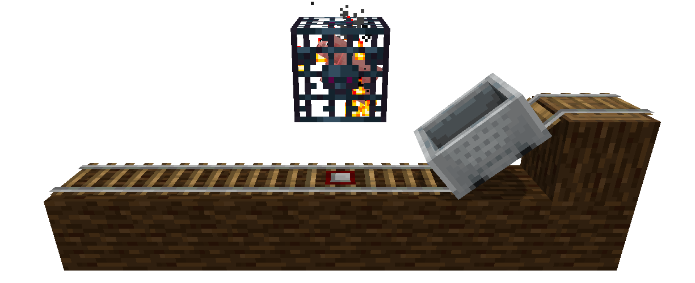
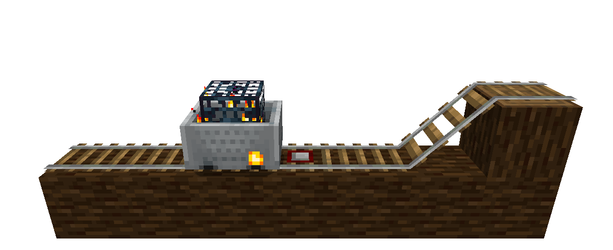

# SpawnerBuff
[todo.sr.ht][tickets]

[tickets]: https://todo.sr.ht/~genbyte/spawnerbuff

Depends on tr7zw's [NBT Item API](https://github.com/tr7zw/Item-NBT-API).

SpawnerBuff allows you to use detector rails to load/unload minecarts with spawners. I think having
to move the spawner on a minecart with rails is much more balanced than being able to use Silk Touch
to pick them up.

## Configuration
There are two configuration values: `allowLoadMinecart` and `allowUnloadMinecart`. They control
being able to put spawners in, and take them out of, minecarts. The default values are true for the
both of them.
